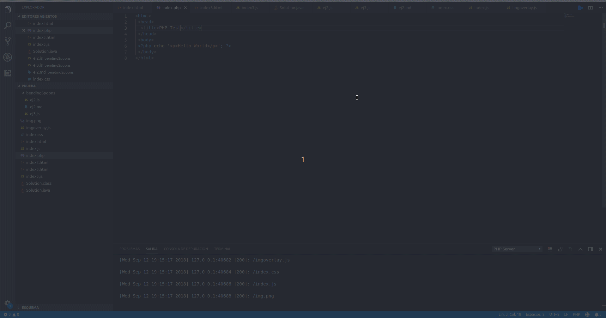

# PHP Server

Host/Serve current workspace (or subfolder) with PHP.

## Features

You can execute it with:
- Ctrl+shift+P and searching for "Serve Project with PHP"
- Clicking on the editor's button (right superior corner)
- Right-clicking on the editor.

To stop the server just search for "Stop PHP Server" or right-click on the editor.

Now with Windows support, auto open localhost in browser and custom router script option added.

### Custom router script

If a custom router script is used on a Windows platform, there will be no console output unless a logger like [this](src/logger.php) is included in the script.

## Requirements

PHP installed.

## Extension Settings
This extension contributes the following settings:

* `phpserver.port`: Server Port Number (Default: 3000)
* `phpserver.relativePath`: Path relative to project (In case that you want to serve a different folder than workspace, Default: "")
* `phpserver.browser`: Select the browser that will open localhost (Default: "firefox", Options: "chrome, firefox, edge, safari, '' ")
* `phpserver.ip`: Server IP ('localhost', '0.0.0.0', ...)
* `phpserver.router`: Specify the location of your custom router script ('router.php', '/home/user/router.php'...)
* `phpserver.phpPath`: Specify the location of your PHP executable. If empty, the extension will use the PHP executable which appears in the $PATH environment variable
* `phpserver.autoOpenOnReload`: Automatically opens current file in browser after server reload

## [Changelog](CHANGELOG.md)

## Known bugs

#### ~~No console output in Windows~~
-----------------------------------------------------------------------------------------------------------

## For more information

* [GitHub](http://github.com/brapifra)

**Enjoy!**
